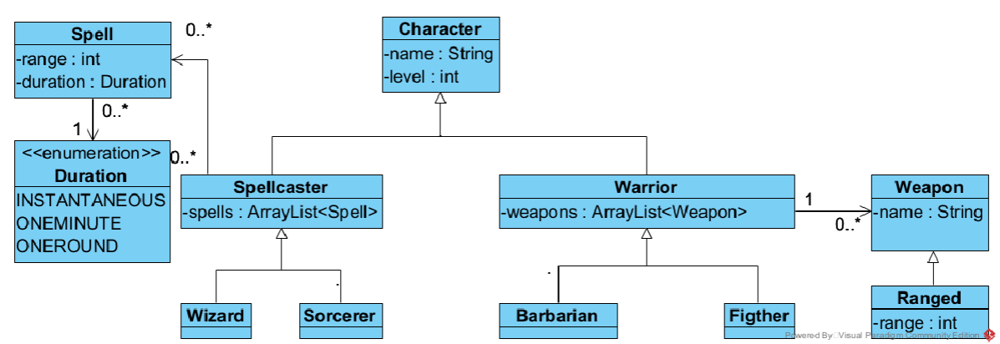

Opgaver lektion 1
Hent starter kode fra https://github.com/benn-christensen/Prog2Lektion01.git
Opgave 1.
a) Implementer følgende klassediagram, der skal modellere et Dungeons and Dragons rolle-
spil. Jeg har fundet inspiration fra https://www.dndbeyond.com/classes.

b) Lav en klasse med en main metode, hvor I opretter en Barbarian karakter med navn Fof-
stelr og tilføj et ”longsword” til hans våbenarsenal Longsword - Equipment - D&D Beyond
(dndbeyond.com).
Lav også et Wizard objekt der ved hvordan man kaster fireballs, en fireball er ”instantaneous”
og har en range på 150 ft Fireball - Spells - D&D Beyond (dndbeyond.com). Hans navn er Or-
lemaex
Tilføj også en ”shortbow” til Fofstelr’s våbenliste Shortbow - Equipment - D&D Beyond (dnd-
beyond.com), med range 80 ft.
Overvej hvorfor du kan tilføje noget af typen ”Ranged” til en ArrayList der indeholder noget
af typen Weapon.
Lav en getter metode til range attributten på Ranged klassen.
Forsøg at gennemløbe Fofstelr’s våbenliste og kald getRange() metoden. Overvej hvorfor du
får en kompilefejl, når du forsøger dette.

c) En ranger https://www.dndbeyond.com/classes/ranger kan både bruge våben og kaste
spells. Lav en Ranger klasse der både nedarver fra Spellcaster og Warrior klassen. Hvad siger
kompileren til dette?
Opgave 2
a) Tilføj toString metoder til modelklasserne Actor, Director, Movie og TVSerie.
2/2

b) Tilføj metoder i Storage klassen der printer alle film og serier der er gemt i movies og
series attributterne.

c) Movie og TVSerie klasserne har lidt duplikeret kode. Lav en specialisering (super-
klasse) til disse to klasser.

d) Lav en metode der givet navnet på en instruktør finder alle de film der er instrueret af
denne instruktør.

e) Lav en metode der givet en genre finder alle serier af denne genre.
Ekstraopgave: Lav metoden om, så den tager en liste af genre.

f) Ekstraopgave: Lige nu har vi en liste til tv-serier og en til film. Så hvis vi også gerne
vil kunne finde film ud fra deres genre, skal vi lave en ny metode der kommer til at
ligne metoden fra delopgave e).
Brug polymorpism (enme til næste lektion) til at samle film og serier i en liste og lav
metode fra delopgave e) om, så den returner både film og serier.
Opgave 3
De tre klasser Car, Truck og Rocket har en del fælles kode. Brug nedarvning til at reducerer
den duplikerede kode.
