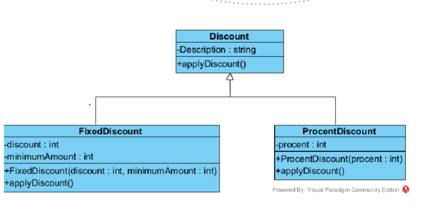
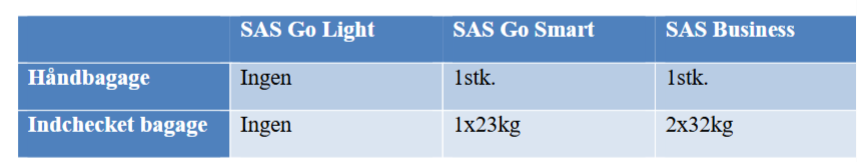

Opgave 1
Geometriske figurer omfatter kvadrat, rektangel, cirkel og ellipse. Det skal være muligt at
beregne figurernes arealer samt at parallelforskyde en figur med en passende afstand i
henholdsvis x og y koordinatens retning. Alle figurer kender deres placering ved en x og y
koordinat samt deres størrelse(radius, sidelængde osv.).
a) Lav et klassediagram for de geometriske figurer

b) Programmer klasserne i henhold til klassediagram
Bemærk: figurerne skal ikke tegnes på skærmen, men de skal kunne udskrive deres tilstand.
Areal for kvadrat er s2, hvor s er længden af kvadratets side.
Areal for rektangel er s1*s2, hvor s1 og s2 er længderne af rektanglets sider.
Areal for cirkel er π*r2, hvor r er cirklens radius.
Areal for ellipse er π*r1*r2, hvor r1 og r2 er ellipsens to radius.

c) Lav en storage klasse hvor du kan gemme geometriske figurer, lav en test klasse med en
main metode, hvor du kan afprøve dine metoder.

Opgave 2
Kik på den eksisterende kode i opgave 2. Der er kommet et nyt krav fra kunden, det skal være
muligt at tilføje en 2-for-1 rabat til kurven, hvor man får den billigste bog gratis, hvis man
køber to bøger.
Det står mere og mere klart, at designet af Discount klassen ikke er hensigtsmæssig. Når man
laver et Discount objekt af typen DiscountType.PROCENT skal man stadig levere
parametrene fixedDiscount og minimumAmount, selv om de ikke skal bruges til at udregne
rabatten for en procentvis rabat. Og med 2-for-1 rabatten skal man ikke bruge nogen af dem.
Ydermere så vil applyDiscount metoden bare vokse og vokse efterhånden som der kommer
nye typer rabatter til.

a) Start med at lave Discount klassen om, så det i stedet for at bruge DiscountTypen
enum’en bruger et nedarvningshierarki

b) Tilføj 2-for-1 rabatten, du kan antage at der er præcis to bøger i indkøbskurven.
Ekstraopgave: Håndtere at man får de 2 billigste bøger hvis man køber 4 bøger, 3
hvis man køber 6 osv.

c) Du er knap nok blevet færdig med at implementerer 2-for-1 rabatten og nu kommer
der nye krav. Butikken er begyndt at handle med e-bøger og nu skal det være muligt at
tilføje procentrabatter der kun gælder for e-bøger. Implementerer de nye krav.

Opgave 3
Følgende er en oversigt over hvad man kan tage med af bagage for udvalgte billettyper hos
SAS.

SAS Go Light SAS Go Smart SAS Business
Håndbagage Ingen 1stk. 1stk.
Indchecket bagage Ingen 1x23kg 2x32kg
Hvis man har behov for at rejse med mere bagage end ens billet tillader, kan man tilkøbe
dette.
Hvis man vil have håndbagage med på en SAS Go Light billet skal man betale 120 kr. Man
må maksimalt have 1 stk. håndbagage med.
3/3
Skal man have ekstra indchecket bagage med ud over det tilladte for ens billet, skal man
betale 310kr.
Skal man have tung bagage med koster det 330 kr. for bagage der vejer mellem 23,1 – 28 kg.
Vejer det mere end 28 kg. koster det 590 kr.
Lav en applikation der kan beregne prisen for ens bagage ud fra hvilket billettype man har.
Dette er en forsimplet version af SAS’s bagage regler, der også afhænger af destinationen og
tidspunktet for indcheckningen af bagagen.