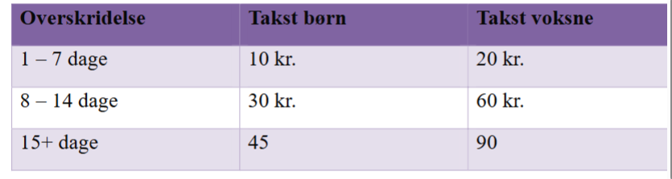

Opgaver lektion 10
https://github.com/benn-christensen/Prog2Lektion10

Opgave 1
Implementer calculatePremium metoden i CarInsurence klassen. Lav unittests
der tester din implementation.

Opgave 2
Aflever du bøger for sent på biblioteket skal du betale en bøde.
Overskridelse Takst børn Takst voksne
1 – 7 dage 10 kr. 20 kr.
8 – 14 dage 30 kr. 60 kr.
15+ dage 45 90
Implementer calculateFine metoden i Loan klassen. Lav unittest der tester din
metode.

Opgave 3
Implementer interface RecentlyUsedList og test din implementation ved hjælp
af unittests.

Opgave 4
Reglerne for Bowling er som følgende (kilde: Wikipedia)

Vælter man alle ti kegler i første forsøg, får man en strike og dermed ikke et nyt
forsøg. Vælter man først de resterende kegler i andet forsøg, får man en spare.
Får man ikke væltet alle 10 kegler, får man point svarende til det antal kegler,
man væltede. Står der stadig en eller flere kegler tilbage i en runde (dvs. efter de
to forsøg), kalder man det at få et miss.
En strike giver 10 kegler plus det antal kegler, man vælter i de to næste slag. En
spare giver 10 kegler plus det antal kegler, man vælter i det næste slag – dvs. her
tæller kun én ekstra kugle med.
Eksempel med strike: Man laver en strike i første runde (hvorved turen er slut,
uden at der bliver tilskrevet kegler til runden). I næste runde vælter man i første
forsøg 7 kegler og i det andet 2. Herved bliver der tilskrevet 10+7+2=19 kegler i
første runde og 2+7=9 for andet, hvilket betyder at man har 19+9=28 kegler
stående i anden runde.
Eksempel med spare: Man laver en spare i første runde og i næste runde vælter
man i første forsøg 7 kegler og i det andet 2. Herved bliver der tilskrevet
10+7=17 kegler i første runde og 2+7=9 for andet, hvilket betyder at man har
17+9=26 keglerstående i anden runde.
Den højeste score, som man kan opnå i en serie, er 300; til dette kræves 12
strikes i træk. En serie består af 10 runder. De første 9 runder består af 2 forsøg.
Den 10. runde er lidt speciel idet den kan bestå af 3 forsøg. Får man en strike
eller en spare – dvs. tager alle kegler med første eller anden kugle – skal der
stadig tælles en eller to ekstra kugler hvor keglefaldet regnes med i ruden.
Lav en klasse der kan beregne point for et spil bowling og brug unittests til at
teste din klasse.
