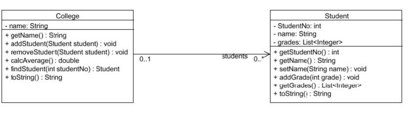

Opgaver lektion 13
https://github.com/benn-christensen/Prog2Lektion13

Opgave 1
I main metoden i Opgave01 er der oprettet et HashSet indeholdende en række
heltal.
a) Udskriv alle tallene i dette set
b) Tilføj 23 til dette set.
c) Udskriv alle tallene igen
d) Fjern 67 fra dette set og udskriv.
e) Controller hvorvidt dette set indeholder 23
f) Udskriv antallet af elementer i dette set.

Opgave 2
I models pakken klassen Range der repræsenterer en talrække. Implementer
iterator metoden i Range klassen, så den returnerer en RangeIterator.
Implementerer hasNext og next metoderne i RangeIterator klassen, således at
foreach løkken i main metoden i Opgave02 udskriver tallene i den angivne
talrække.

Opgave 3
Betragt følgende klassediagram

a) Implementer de to klasser med de viste attributter og metoder. Tilføj
passende constructor. Lav link attributten i College klassen som en
List<Student> og brug ArrayList som konkret objekt.
Metoden calcAverage skal returnere gennemsnittet af alle studerendes
karakter (grades)
findStudent skal returnerer en studerende men samme studentNo.
Test din implementering.
b) Ændrer din implementering af link attributten i College klassen til at være
at typen Set<Student>. Brug LinkedHashSet som konkret klasse.
Ret dine tests til så de passer til den nye implementering
c) Lav nu link attributten om så du bruger Map<Integer, Student>, med
studentNo som nøgle. Brug LinkedHashMap som konkret klasse.
d) Implementer Comparable interface for Student klassen. Sammenlign på
studentNo attributten
e) Hvis vi ønsker at sorterer studerende på deres navn, kan vi bruge
Comparator interfacet til dette. Sort de studerende ved hjælp af
Comparator interfacet.
f) Alle klasser arver equals og hashCode metoderne fra Object klassen,
overskriv equals og hashCode metoderne i Student klassen, så to Student
objekter med det StudentNo er ens.
g) Test din kode.

